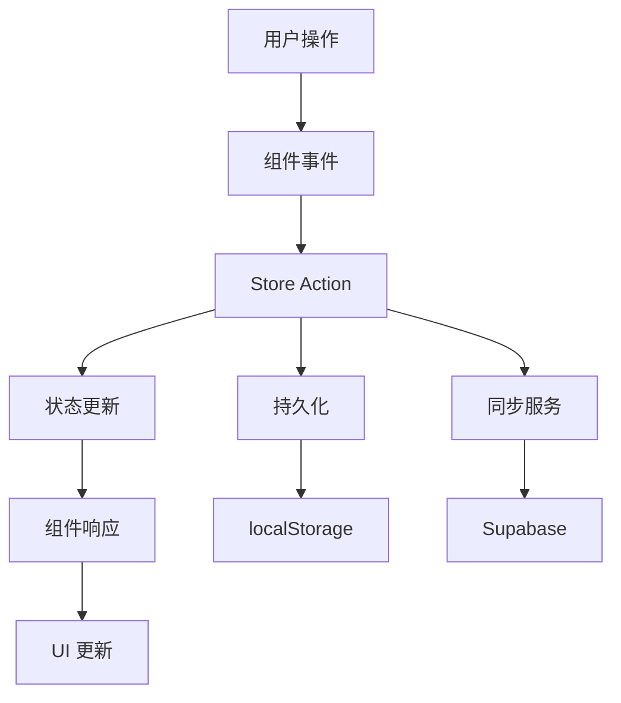

# 技术架构

本文档详细介绍 FocusTide 的技术架构、设计模式和核心概念。

## 🏗️ 整体架构

FocusTide 采用现代化的前端架构，基于 Nuxt.js 3 构建，遵循组件化、模块化的设计原则。

```
┌─────────────────────────────────────────────────────────┐
│                    用户界面层                              │
│  ┌─────────────┐ ┌─────────────┐ ┌─────────────┐        │
│  │   计时器     │ │   设置面板   │ │   任务列表   │        │
│  └─────────────┘ └─────────────┘ └─────────────┘        │
├─────────────────────────────────────────────────────────┤
│                    组件层                                │
│  ┌─────────────┐ ┌─────────────┐ ┌─────────────┐        │
│  │  基础组件    │ │  业务组件    │ │  布局组件    │        │
│  └─────────────┘ └─────────────┘ └─────────────┘        │
├─────────────────────────────────────────────────────────┤
│                    状态管理层                             │
│  ┌─────────────┐ ┌─────────────┐ ┌─────────────┐        │
│  │   Settings  │ │   Timer     │ │   Tasks     │        │
│  └─────────────┘ └─────────────┘ └─────────────┘        │
├─────────────────────────────────────────────────────────┤
│                    服务层                                │
│  ┌─────────────┐ ┌─────────────┐ ┌─────────────┐        │
│  │  同步服务    │ │  音频服务    │ │  通知服务    │        │
│  └─────────────┘ └─────────────┘ └─────────────┘        │
├─────────────────────────────────────────────────────────┤
│                    数据层                                │
│  ┌─────────────┐ ┌─────────────┐ ┌─────────────┐        │
│  │  本地存储    │ │   Supabase  │ │   缓存      │        │
│  └─────────────┘ └─────────────┘ └─────────────┘        │
└─────────────────────────────────────────────────────────┘
```

## 🎯 核心技术栈

### 前端框架
- **Nuxt.js 3**: 基于 Vue.js 3 的全栈框架
- **Vue.js 3**: 响应式前端框架，使用 Composition API
- **TypeScript**: 类型安全的 JavaScript 超集

### 状态管理
- **Pinia**: 现代化的 Vue 状态管理库
- **持久化**: 基于 localStorage 的状态持久化

### 样式系统
- **Tailwind CSS**: 实用优先的 CSS 框架
- **SCSS**: CSS 预处理器
- **PostCSS**: CSS 后处理工具

### 构建工具
- **Vite**: 快速的构建工具
- **ESBuild**: 高性能的 JavaScript 打包器

### 开发工具
- **ESLint**: JavaScript/TypeScript 代码检查
- **Stylelint**: CSS/SCSS 代码检查
- **Prettier**: 代码格式化

## 📁 项目结构

```
FocusTide/
├── app.vue                 # 应用根组件
├── nuxt.config.ts         # Nuxt 配置文件
├── tailwind.config.js     # Tailwind 配置
├── tsconfig.json          # TypeScript 配置
│
├── components/            # Vue 组件
│   ├── base/             # 基础 UI 组件
│   ├── timer/            # 计时器相关组件
│   ├── settings/         # 设置相关组件
│   ├── todoList/         # 任务列表组件
│   └── whiteNoise/       # 白噪音组件
│
├── stores/               # Pinia 状态管理
│   ├── settings.ts       # 设置状态
│   ├── main.ts          # 主要状态
│   ├── tasklist.ts      # 任务列表状态
│   └── auth.ts          # 认证状态
│
├── services/             # 业务服务
│   └── syncService.ts    # 数据同步服务
│
├── assets/               # 静态资源
│   ├── scss/            # 样式文件
│   ├── settings/        # 设置相关资源
│   └── mixins/          # 混入文件
│
├── i18n/                # 国际化文件
│   ├── en.json          # 英文翻译
│   ├── zh.json          # 中文翻译
│   └── ...              # 其他语言
│
├── public/              # 公共静态文件
│   ├── audio/           # 音频文件
│   ├── icons/           # 图标文件
│   └── img/             # 图片文件
│
├── modules/             # Nuxt 模块
│   └── build/           # 构建相关模块
│
├── platforms/           # 平台特定代码
│   ├── web.ts           # Web 平台
│   └── mobile.ts        # 移动端平台
│
├── plugins/             # Nuxt 插件
│   ├── i18n.ts          # 国际化插件
│   └── store-persist.client.ts  # 状态持久化
│
└── docs/                # 项目文档
```

## 🔄 数据流架构

### 状态管理流程



### 组件通信模式

1. **父子组件**: Props + Events
2. **跨组件**: Pinia Store
3. **全局事件**: Event Bus (EventTarget)
4. **依赖注入**: Provide/Inject

## 🧩 核心模块设计

### 1. 计时器系统

```typescript
// 计时器状态接口
interface TimerState {
  isRunning: boolean
  currentTime: number
  totalTime: number
  currentSection: SectionType
  schedule: ScheduleItem[]
}

// 计时器控制器
class TimerController {
  start(): void
  pause(): void
  reset(): void
  skip(): void
  tick(): void
}
```

### 2. 设置系统

```typescript
// 设置状态结构
interface SettingsState {
  timer: TimerSettings
  display: DisplaySettings
  audio: AudioSettings
  tasks: TaskSettings
  theme: ThemeSettings
}

// 设置持久化
class SettingsPersistence {
  save(settings: SettingsState): void
  load(): SettingsState
  reset(): void
}
```

### 3. 任务管理

```typescript
// 任务数据结构
interface Task {
  id: string
  title: string
  completed: boolean
  section: SectionType
  priority: Priority
}

// 任务管理器
class TaskManager {
  addTask(task: Partial<Task>): void
  updateTask(id: string, updates: Partial<Task>): void
  deleteTask(id: string): void
  getTasksBySection(section: SectionType): Task[]
}
```

## 🎨 设计模式

### 1. 组合式 API 模式

```typescript
// 使用 Composition API 组织逻辑
export function useTimer() {
  const isRunning = ref(false)
  const currentTime = ref(0)
  
  const start = () => {
    isRunning.value = true
  }
  
  const pause = () => {
    isRunning.value = false
  }
  
  return {
    isRunning: readonly(isRunning),
    currentTime: readonly(currentTime),
    start,
    pause
  }
}
```

### 2. 服务层模式

```typescript
// 业务逻辑封装在服务中
export class SyncService {
  async syncData(): Promise<void>
  async exportData(): Promise<void>
  async importData(): Promise<void>
}

export const syncService = new SyncService()
```

### 3. 观察者模式

```typescript
// 事件系统
export class EventBus extends EventTarget {
  emit(type: string, data?: any): void
  on(type: string, listener: EventListener): void
  off(type: string, listener: EventListener): void
}
```

## 🔧 配置系统

### Nuxt 配置

```typescript
// nuxt.config.ts
export default defineNuxtConfig({
  // SSR 配置
  ssr: true,
  
  // 模块配置
  modules: [
    '@pinia/nuxt',
    '@nuxtjs/supabase',
    '@nuxtjs/google-fonts'
  ],
  
  // 构建配置
  vite: {
    define: {
      __VUE_OPTIONS_API__: false
    }
  }
})
```

### TypeScript 配置

```json
{
  "extends": "./.nuxt/tsconfig.json",
  "compilerOptions": {
    "strict": true,
    "noImplicitAny": true,
    "strictNullChecks": true
  }
}
```

## 📱 响应式设计

### 断点系统

```scss
// Tailwind 断点
$breakpoints: (
  'sm': '640px',
  'md': '768px',
  'lg': '1024px',
  'xl': '1280px',
  '2xl': '1536px'
);
```

### 移动端适配

- 触摸友好的交互设计
- 适配不同屏幕尺寸
- PWA 支持
- 性能优化

## 🚀 性能优化

### 代码分割

- 路由级别的代码分割
- 组件懒加载
- 动态导入

### 缓存策略

- 静态资源缓存
- API 响应缓存
- Service Worker 缓存

### 构建优化

- Tree Shaking
- 代码压缩
- 图片优化
- 字体优化

---

**下一步**: 查看 [组件系统](./components.md) 了解组件架构设计
