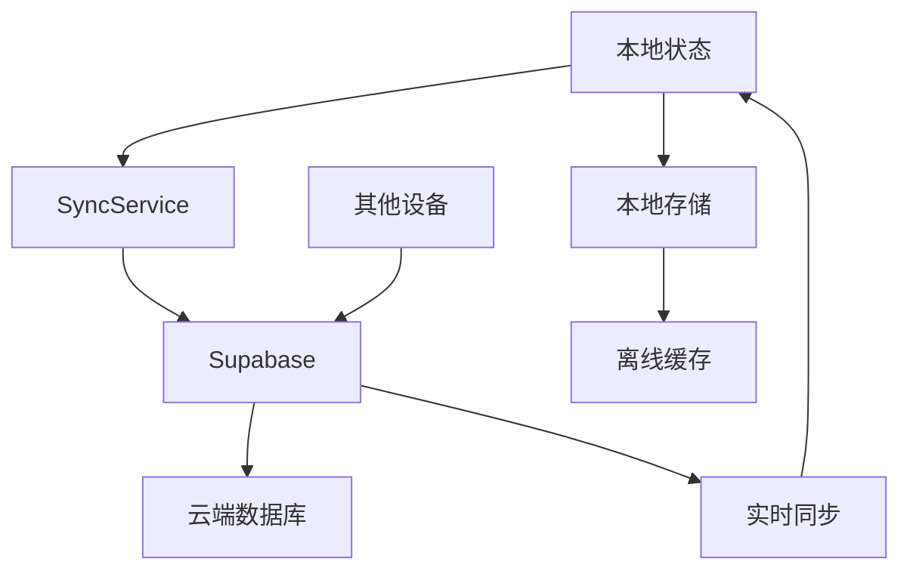

# 数据同步系统

FocusTide 的数据同步系统基于 Supabase 构建，提供用户认证、云端存储和跨设备数据同步功能。

## 🎯 系统概述

数据同步系统的核心功能：

- **用户认证**: 邮箱/密码登录注册
- **数据同步**: 设置、任务、统计数据的云端同步
- **离线支持**: 本地数据存储，网络恢复时自动同步
- **冲突解决**: 智能的数据冲突处理机制
- **数据导入导出**: 本地备份和恢复功能

## 🏗️ 架构设计

### 系统组件

```
数据同步系统
├── AuthService         # 认证服务
├── SyncService         # 同步服务
├── DataManager         # 数据管理器
├── ConflictResolver    # 冲突解决器
└── BackupService       # 备份服务
```

### 数据流



## 🔐 用户认证

### 认证状态管理

```typescript
// stores/auth.ts
export interface AuthState {
  user: User | null
  session: Session | null
  loading: boolean
  error: string | null
  syncStatus: 'idle' | 'syncing' | 'error'
  lastSynced: string | null
  syncInterval: string // 'manual', '5min', '15min', '30min', '60min'
}

export const useAuth = defineStore('auth', {
  state: (): AuthState => ({
    user: null,
    session: null,
    loading: false,
    error: null,
    syncStatus: 'idle',
    lastSynced: null,
    syncInterval: 'manual'
  }),
  
  getters: {
    isAuthenticated: (state) => !!state.user,
    isSyncing: (state) => state.syncStatus === 'syncing'
  },
  
  actions: {
    async signUp(email: string, password: string) {
      this.loading = true
      this.error = null
      
      try {
        const supabase = useSupabaseClient()
        const { data, error } = await supabase.auth.signUp({
          email,
          password
        })
        
        if (error) throw error
        
        this.user = data.user
        this.session = data.session
        
        // 初始同步
        if (data.user) {
          await this.initialSync()
        }
      } catch (error: any) {
        this.error = error.message
      } finally {
        this.loading = false
      }
    },
    
    async signIn(email: string, password: string) {
      this.loading = true
      this.error = null
      
      try {
        const supabase = useSupabaseClient()
        const { data, error } = await supabase.auth.signInWithPassword({
          email,
          password
        })
        
        if (error) throw error
        
        this.user = data.user
        this.session = data.session
        
        // 初始同步
        if (data.user) {
          await this.initialSync()
        }
      } catch (error: any) {
        this.error = error.message
      } finally {
        this.loading = false
      }
    },
    
    async signOut() {
      // 先同步最新数据
      await this.syncData()
      
      const supabase = useSupabaseClient()
      const { error } = await supabase.auth.signOut()
      
      if (error) {
        this.error = error.message
      } else {
        this.user = null
        this.session = null
      }
    }
  }
})
```

### 认证组件

```vue
<!-- components/auth/signInModal.vue -->
<template>
  <div class="auth-modal">
    <form @submit.prevent="handleSignIn" class="auth-form">
      <h2 class="auth-title">{{ $t('auth.signIn') }}</h2>
      
      <div class="form-group">
        <label>{{ $t('auth.email') }}</label>
        <input
          v-model="email"
          type="email"
          required
          :placeholder="$t('auth.emailPlaceholder')"
        />
      </div>
      
      <div class="form-group">
        <label>{{ $t('auth.password') }}</label>
        <input
          v-model="password"
          type="password"
          required
          :placeholder="$t('auth.passwordPlaceholder')"
        />
      </div>
      
      <div v-if="authStore.error" class="error-message">
        {{ authStore.error }}
      </div>
      
      <button
        type="submit"
        :disabled="authStore.loading"
        class="submit-button"
      >
        {{ authStore.loading ? $t('auth.signingIn') : $t('auth.signIn') }}
      </button>
    </form>
  </div>
</template>

<script setup lang="ts">
import { ref } from 'vue'
import { useAuth } from '~/stores/auth'

const authStore = useAuth()

const email = ref('')
const password = ref('')

const handleSignIn = async () => {
  await authStore.signIn(email.value, password.value)
  
  if (!authStore.error) {
    // 登录成功，关闭模态框
    emit('close')
  }
}

const emit = defineEmits<{
  close: []
}>()
</script>
```

## 🔄 数据同步服务

### 同步服务核心

```typescript
// services/syncService.ts
export class SyncService {
  private authStore: ReturnType<typeof useAuth>
  private settingsStore: ReturnType<typeof useSettings>
  private focusStatsStore: ReturnType<typeof useFocusStats>
  private tasklistStore: ReturnType<typeof useTasklist>
  private focusGoalsStore: ReturnType<typeof useFocusGoals>
  private supabase: SupabaseClient

  constructor() {
    // 延迟初始化，确保 Pinia 已经准备好
    setTimeout(() => {
      this.authStore = useAuth()
      this.settingsStore = useSettings()
      this.focusStatsStore = useFocusStats()
      this.tasklistStore = useTasklist()
      this.focusGoalsStore = useFocusGoals()
      this.supabase = useSupabaseClient()
    }, 0)
  }

  // 确保 stores 已初始化
  private ensureStoresInitialized() {
    if (!this.authStore || !this.settingsStore || !this.focusStatsStore || !this.tasklistStore || !this.focusGoalsStore) {
      this.authStore = useAuth()
      this.settingsStore = useSettings()
      this.focusStatsStore = useFocusStats()
      this.tasklistStore = useTasklist()
      this.focusGoalsStore = useFocusGoals()
      this.supabase = useSupabaseClient()
    }
  }

  // 初始同步 - 首次登录时调用
  async initialSync() {
    this.ensureStoresInitialized()
    
    if (!this.authStore?.user) {
      console.warn('Cannot perform initial sync: User not authenticated')
      return
    }

    this.authStore.syncStatus = 'syncing'

    try {
      // 同步设置
      await this.syncSettings()

      // 同步专注会话
      await this.syncFocusSessions()

      // 同步任务
      await this.syncTasks()

      // 同步目标
      await this.syncFocusGoals()

      this.authStore.lastSynced = new Date().toISOString()
      this.authStore.syncStatus = 'idle'
      
      console.log('Initial sync completed successfully')
    } catch (error) {
      console.error('Initial sync failed:', error)
      this.authStore.syncStatus = 'error'
    }
  }

  // 增量同步 - 定期调用或手动触发
  async syncData() {
    this.ensureStoresInitialized()
    
    if (!this.authStore?.user) {
      console.warn('Cannot sync: User not authenticated')
      return
    }

    this.authStore.syncStatus = 'syncing'

    try {
      // 同步各个 store 的数据
      await this.syncSettings()
      await this.syncFocusSessions()
      await this.syncTasks()
      await this.syncFocusGoals()

      this.authStore.lastSynced = new Date().toISOString()
      this.authStore.syncStatus = 'idle'
    } catch (error) {
      console.error('Sync failed:', error)
      this.authStore.syncStatus = 'error'
    }
  }

  // 同步设置
  private async syncSettings() {
    if (!this.authStore?.user) return
    const userId = this.authStore.user.id

    // 获取云端设置
    const { data: cloudSettings, error } = await this.supabase
      .from('user_settings')
      .select('*')
      .eq('id', userId)
      .single()

    if (error && error.code !== 'PGRST116') {
      throw error
    }

    if (!cloudSettings) {
      // 如果云端没有设置，上传本地设置
      await this.supabase
        .from('user_settings')
        .upsert({
          id: userId,
          settings: this.settingsStore.$state,
          updated_at: new Date().toISOString()
        })
    } else {
      // 如果云端有设置，比较时间戳并合并
      const localUpdatedAt = localStorage.getItem('settings_updated_at')
      const cloudUpdatedAt = cloudSettings.updated_at

      if (!localUpdatedAt || new Date(cloudUpdatedAt) > new Date(localUpdatedAt)) {
        // 云端数据更新，更新本地
        this.settingsStore.$patch(cloudSettings.settings)
        localStorage.setItem('settings_updated_at', cloudUpdatedAt)
      } else {
        // 本地数据更新，更新云端
        await this.supabase
          .from('user_settings')
          .upsert({
            id: userId,
            settings: this.settingsStore.$state,
            updated_at: new Date().toISOString()
          })
      }
    }
  }

  // 同步专注会话
  private async syncFocusSessions() {
    if (!this.authStore?.user) return
    const userId = this.authStore.user.id

    // 获取本地会话
    const localSessions = this.focusStatsStore.sessions

    // 获取云端会话
    const { data: cloudSessions, error } = await this.supabase
      .from('focus_sessions')
      .select('*')
      .eq('user_id', userId)

    if (error) {
      throw error
    }

    // 创建会话 ID 映射
    const cloudSessionMap = new Map()
    cloudSessions?.forEach(session => {
      cloudSessionMap.set(session.session_id, session)
    })

    // 上传新的本地会话
    const sessionsToUpload = localSessions.filter(session => !cloudSessionMap.has(session.id))

    if (sessionsToUpload.length > 0) {
      const uploadData = sessionsToUpload.map(session => ({
        user_id: userId,
        session_id: session.id,
        start_time: session.startTime,
        end_time: session.endTime,
        duration: session.duration,
        completed: session.completed,
        type: session.type,
        interruptions: session.interruptions
      }))

      const { error: uploadError } = await this.supabase
        .from('focus_sessions')
        .upsert(uploadData)

      if (uploadError) {
        throw uploadError
      }
    }

    // 下载新的云端会话
    const localSessionIds = new Set(localSessions.map(session => session.id))
    const newCloudSessions = cloudSessions?.filter(session => !localSessionIds.has(session.session_id)) || []

    if (newCloudSessions.length > 0) {
      const sessionsToImport = newCloudSessions.map(session => ({
        id: session.session_id,
        startTime: session.start_time,
        endTime: session.end_time,
        duration: session.duration,
        completed: session.completed,
        type: session.type,
        interruptions: session.interruptions
      }))

      // 导入新会话
      this.focusStatsStore.importSessions([...localSessions, ...sessionsToImport])
    }
  }
}

export const syncService = new SyncService()
```

## 📤 数据导入导出

### 导出功能

```typescript
// 导出数据
async exportData() {
  this.ensureStoresInitialized()
  
  try {
    const data = {
      settings: this.settingsStore.$state,
      sessions: this.focusStatsStore.sessions,
      tasks: this.tasklistStore.tasks,
      goals: {
        dailyGoalMinutes: this.focusGoalsStore.dailyGoalMinutes,
        weeklyGoalMinutes: this.focusGoalsStore.weeklyGoalMinutes,
        dailyGoalSessions: this.focusGoalsStore.dailyGoalSessions,
        weeklyGoalSessions: this.focusGoalsStore.weeklyGoalSessions,
        streakDays: this.focusGoalsStore.streakDays,
        lastCompletedDay: this.focusGoalsStore.lastCompletedDay
      }
    }

    const dataStr = JSON.stringify(data)
    const dataUri = `data:application/json;charset=utf-8,${encodeURIComponent(dataStr)}`

    const exportFileDefaultName = `focustide_backup_${new Date().toISOString().slice(0, 10)}.json`

    const linkElement = document.createElement('a')
    linkElement.setAttribute('href', dataUri)
    linkElement.setAttribute('download', exportFileDefaultName)
    document.body.appendChild(linkElement) // 确保在所有浏览器中都能正常工作
    linkElement.click()
    document.body.removeChild(linkElement) // 清理 DOM
    
    console.log('Data exported successfully')
  } catch (error) {
    console.error('Failed to export data:', error)
  }
}
```

### 导入功能

```typescript
// 导入数据
async importData() {
  this.ensureStoresInitialized()
  
  try {
    const input = document.createElement('input')
    input.type = 'file'
    input.accept = 'application/json'
    document.body.appendChild(input) // 确保在所有浏览器中都能正常工作

    input.onchange = async (event) => {
      const file = (event.target as HTMLInputElement).files?.[0]
      if (!file) {
        document.body.removeChild(input)
        return
      }

      const reader = new FileReader()

      reader.onload = async (e) => {
        try {
          const data = JSON.parse(e.target?.result as string)

          // 导入设置
          if (data.settings) {
            this.settingsStore.$patch(data.settings)
          }

          // 导入会话
          if (data.sessions) {
            this.focusStatsStore.importSessions(data.sessions)
          }

          // 导入任务
          if (data.tasks) {
            this.tasklistStore.tasks = data.tasks
          }

          // 导入目标
          if (data.goals) {
            this.focusGoalsStore.$patch(data.goals)
          }

          console.log('Data imported successfully')

          // 如果用户已登录，同步到云端
          if (this.authStore?.isAuthenticated) {
            await this.syncData()
          }
        } catch (error) {
          console.error('Failed to import data:', error)
        } finally {
          document.body.removeChild(input) // 清理 DOM
        }
      }

      reader.onerror = () => {
        console.error('Error reading file')
        document.body.removeChild(input)
      }

      reader.readAsText(file)
    }

    input.click()
  } catch (error) {
    console.error('Failed to import data:', error)
  }
}
```

## 🗄️ 数据库结构

### Supabase 表结构

```sql
-- 用户设置表
CREATE TABLE user_settings (
  id UUID PRIMARY KEY REFERENCES auth.users(id),
  settings JSONB NOT NULL,
  updated_at TIMESTAMP WITH TIME ZONE DEFAULT NOW()
);

-- 专注会话表
CREATE TABLE focus_sessions (
  id UUID PRIMARY KEY DEFAULT gen_random_uuid(),
  user_id UUID REFERENCES auth.users(id),
  session_id TEXT NOT NULL,
  start_time TIMESTAMP WITH TIME ZONE NOT NULL,
  end_time TIMESTAMP WITH TIME ZONE,
  duration INTEGER NOT NULL,
  completed BOOLEAN DEFAULT FALSE,
  type TEXT NOT NULL,
  interruptions INTEGER DEFAULT 0,
  created_at TIMESTAMP WITH TIME ZONE DEFAULT NOW()
);

-- 任务表
CREATE TABLE tasks (
  id UUID PRIMARY KEY DEFAULT gen_random_uuid(),
  user_id UUID REFERENCES auth.users(id),
  task_id TEXT NOT NULL,
  title TEXT NOT NULL,
  description TEXT,
  priority TEXT DEFAULT 'medium',
  section TEXT NOT NULL,
  state TEXT DEFAULT 'active',
  keep_on_screen BOOLEAN DEFAULT FALSE,
  created_at TIMESTAMP WITH TIME ZONE DEFAULT NOW(),
  updated_at TIMESTAMP WITH TIME ZONE DEFAULT NOW()
);

-- 专注目标表
CREATE TABLE focus_goals (
  id UUID PRIMARY KEY REFERENCES auth.users(id),
  daily_goal_minutes INTEGER DEFAULT 120,
  weekly_goal_minutes INTEGER DEFAULT 840,
  daily_goal_sessions INTEGER DEFAULT 4,
  weekly_goal_sessions INTEGER DEFAULT 20,
  streak_days INTEGER DEFAULT 0,
  last_completed_day DATE,
  updated_at TIMESTAMP WITH TIME ZONE DEFAULT NOW()
);
```

## 🔧 同步策略

### 冲突解决

1. **时间戳优先**: 使用最新的 `updated_at` 时间戳
2. **合并策略**: 对于数组数据（如会话、任务），进行合并而非覆盖
3. **用户选择**: 对于重要冲突，提供用户选择界面

### 同步频率

- **手动同步**: 用户主动触发
- **自动同步**: 5分钟、15分钟、30分钟、60分钟间隔
- **事件触发**: 登录、注销、重要数据变更时

### 离线处理

- **本地优先**: 离线时所有操作在本地进行
- **队列机制**: 网络恢复时按顺序同步操作
- **冲突标记**: 标记可能存在冲突的数据

---

**下一步**: 查看 [用户认证](./authentication.md) 了解认证系统详情
